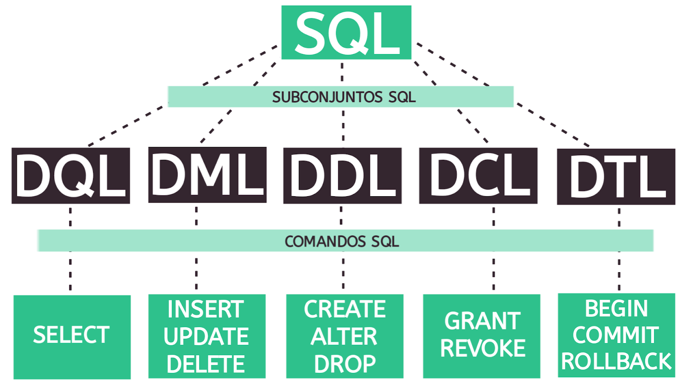

# Curso de SQL

[indice do curso](../README.md#curso-de-sql---structured-query-language)

---

O SQL acrônimo de __Structured Query Language__, ou em português __Linguagem de Consulta Estruturada__ é uma linguagem que tem extrema relevância quando o assunto é manipulação de dados tabulares, o que a torna uma ferramenta essencial para diversas áreas da tecnologia.

- [O que é SQL?](#o-que-e-sql)
- [Como surgiu o SQL? História e criador!](#origem)
- [Para que serve e onde o SQL é usado?](#para-que-serve)
- [Quais as vantagens e desvantagens da linguagem SQL?](#pros-contras)
- [Porque aprender SQL?](#porque-aprender)
- [Como está o mercado de trabalho para SQL?](#mercado)
- [Conheça os 5 subconjuntos da linguagem SQL](#subconjunto-sql)

## O que é SQL?

O SQL é uma linguagem padrão para manipulação de registros em bancos de dados relacionais. A sigla SQL vem dos termos em inglês “Structured Query Language”, que podem ser traduzidos para o português como “Linguagem de Consulta Estruturada”.

Trata-se ainda de uma linguagem declarativa que apresenta sintaxe simples e fácil de ser aprendida até por pessoas iniciantes na área da programação.

## Como surgiu o SQL? História e criador!

A linguagem SQL surgiu a partir de um estudo realizado na década de 70 pelo laboratório da IBM.
Esse estudo tinha como um de seus objetivos elaborar uma linguagem que fosse capaz de simplificar o gerenciamento de informações em bancos de dados do tipo relacional (baseado em tabelas).

Foi aí que surgiu a especificação original do SQL, que foi feita por dois conhecidos cientistas da computação, Donald D. Chamberlim e Raymond F. Boyce. O sucesso da linguagem foi imediato e rapidamente diversos “dialetos” começaram a ser desenvolvidos, o que gerou a necessidade do ANSI (American National Standards Institute) padronizar o seu uso.

Assim, o SQL continua sendo usado em grande parte dos bancos de dados relacionais até os dias atuais. Mas, apesar da padronização da linguagem, ainda existem algumas variações utilizadas por diferentes SGBDs (Sistemas Gerenciadores do Bancos de Dados).

## Para que serve e onde o SQL é usado?

O SQL é usado para fazer qualquer tipo de manipulação dos registros de um banco de dados.
Ou seja, ele serve para criar, inserir, atualizar, excluir e consultar as informações armazenadas na base, além de outras diversas funções mais complexas.

Atualmente, vários SGBDs amplamente utilizados no mercado são baseados em SQL.
Isso acontece porque bancos do tipo relacional armazenam as informações em estruturas tabulares, permitindo que sejam criadas relações entre elas.

A linguagem SQL foi criada justamente para facilitar o gerenciamento de dados armazenados em base de dados em formato tabular.

Alguns dos principais sistemas que utilizam essa tecnologia são:

- PostgreSQL: muito usado em aplicações web, essa é uma opção gratuita de código aberto;
- Oracle: conhecido pela sua segurança, esse sistema é um dos mais usados por grandes corporações;
- MS SQL Server: desenvolvido pela Microsoft, ele oferece tanto serviços pagos quanto versões gratuitas para download.
- MySQL: ofertado pela Oracle, é uma opção que oferece serviços gratuitos e pagos;
- MariaDB: Variação gratuíta do MySQL;

## Prós e contras da linguagem SQL?

E aí, conseguimos deixar evidente para que serve o SQL?
Então, agora, confira quais são as vantagens e desvantagens que podemos encontrar nessa linguagem:

**Principais vantagens**

Padronização: como dissemos mais acima, o SQL foi padronizado pelo ANSI.
Por isso, ela oferece uma ampla documentação e, aprendendo a linguagem,
você vai conseguir lidar facilmente com diferentes bancos de dados que a implementam;

Rápido acesso aos dados: SQL permite a recuperação de múltiplos registros
com um único comando, tudo feito de forma rápida e eficiente;

Portabilidade: o SQL pode ser usado em diversas aplicações para diferentes plataformas;

Múltiplas visões de dados: com SQL é possível definir diferentes visualizações da estrutura do banco para diferentes pessoas usuárias;

Linguagem cliente/servidor: com SQL é possível implementar arquitetura cliente-servidor.

**Principais desvantagens**

Dificuldade com a interface: para quem não está acostumado, a interface de um banco de dados SQL pode ser mais difícil de lidar;

Custo: o custo operacional de alguns serviços oferecidos por bancos que utilizam SQL é caro e dificulta o acesso dos desenvolvedores.

## Porque aprender SQL?

Há 5 motivos para começar a aprender agora! Já falamos sobre as principais vantagens que o SQL oferece, mas para quem trabalha na área da tecnologia, qual seriam os benefícios de aprender essa linguagem? A resposta você vai encontrar nos tópicos abaixo. Confira!

1. SQL é usada em diversas aplicações
Atualmente, a linguagem SQL é usada nas mais variadas aplicações, incluindo em sistemas de grandes empresas da tecnologia, como Google, Amazon, Uber e Netflix. Por isso, mesmo que você não vá trabalhar diretamente com bancos de dados, é bem provável que em algum momento você tenha que recuperar e manipular dados da base. Nessa hora, ter conhecimento em SQL vai fazer toda a diferença!

2. É fácil de aprender
Por ser uma linguagem declarativa com sintaxe muito semelhante ao inglês, o aprendizado em SQL ocorre praticamente de forma intuitiva. Ou seja, é possível começar a utilizar seus comandos mais simples quase imediatamente. Assim, você não vai precisar de muito tempo para ter um bom domínio da linguagem.

3. Você vai ser um(a) desenvolvedor(a) melhor
Ter um bom conhecimento em SQL muda nossa perspectiva na hora de programar, pois temos um leque maior de possibilidades para desenvolver uma solução. Além disso, esse conhecimento é essencial para quem quer atuar como profissional Full Stack.

4. SQL é uma linguagem estável
Ao contrário de outras linguagens que perdem força com o tempo, o SQL continua sendo amplamente utilizado para a manipulação de dados, mesmo sendo uma linguagem considerada antiga. Por isso, ela é vista como uma linguagem estável e o tempo investido no seu aprendizado certamente será recompensado.

5. Você vai ter mais oportunidades no mercado
Com tantos sistemas utilizando SQL por aí, a oferta de empregos na área não para de aumentar. Por isso, ter experiência no seu currículo com essa linguagem certamente vai ajudar você a conseguir ofertas de trabalho mais interessantes, inclusive algumas com alta remuneração.

## Como está o mercado de trabalho para SQL?

O mercado de trabalho para quem tem conhecimentos em SQL é bastante promissor, tanto para quem pretende atuar diretamente com banco de dados ou quanto para quem quer ser um desenvolvedor mais completo.

Uma das possibilidades mais interessantes, por exemplo, é trabalhar como DBA, ou Administrador de Banco de Dados.
A pessoa que atua nesse cargo tem a responsabilidade de implementar, monitorar, atualizar e garantir a segurança do banco, o que requer um excelente nível de conhecimento em SQL.

De acordo com a plataforma Glassdoor, o salário médio de um DBA no Brasil fica em torno de R$ 6.575. Sem dúvidas, uma excelente oportunidade, não é?

Já segundo o Guia de Profissões da Catho, um Analista de Sistemas SQL recebe uma média salarial de R$ 6.580.

Entretanto, existem vários outros cargos nos quais você pode encontrar oportunidades. Afinal, muitas áreas da tecnologia exigem algum nível de conhecimento em SQL. Entre elas, podemos citar:

Cientista da Computação;
Engenharia de Software;
Business Intelligence;
Data Science;
Programação;
Analista de Dados;
Engenheiro de dados;
Analista de Sistemas, entre outros.

## Subconjuntos da linguagem SQL e seus comandos

A linguagem SQL apresenta uma organização estrutural muito bem definida que divide seus comandos em 5 subconjuntos diferentes. Cada um desses conjuntos apresenta objetivos específicos que explicaremos a seguir. Observe!

**DML**: linguagem de manipulação de dados
O DML (Data Manipulation Language) é o subconjunto do SQL que define os comandos usados para manipular os dados armazenados em um banco. Esse é um dos conjuntos mais utilizados, pois ele fornece operadores que nos permitem inserir, excluir e alterar os registros de uma tabela, por exemplo. Os comandos mais importantes desse subconjunto são: INSERT, DELETE e UPDATE.

**DQL**: linguagem de consulta de dados
O DQL (Data Query Language) é o conjunto SQL que define o comando mais popular da linguagem, o SELECT. Esse comando é essencial para que possamos consultar os dados que armazenamos em nosso banco.

**DDL**: linguagem de definição de dados
O DDL (Data Definition Language) é o subconjunto SQL que apresenta comandos usados para gerenciar as estruturas do banco de dados. Com ele, podemos criar, atualizar e remover objetos da base, como tabelas e índices. Os comandos definidos pelo DDL são: CREATE, DROP e ALTER.

**DCL**: linguagem de controle de dados
O DCL (Data Control Language) é o subconjunto no qual encontramos comandos para controlar o acesso aos dados da nossa base. Utilizando esse conjunto, conseguimos estabelecer restrições e permissões para quem acessa o banco por meio dos comandos GRANT e REVOKE.

**DTL** ou **TCL**: linguagem de transação de dados
O DTL (Data Transaction Language) — também conhecido como TCL (Transaction Control Language) — é o subconjunto SQL que define comandos que utilizamos quando é necessário gerenciar transações feitas no banco. Isso significa que eles permitem iniciar, confirmar e desfazer determinadas alterações. Os comandos estabelecidos pelo conjunto são COMMIT, BEGIN e ROLLBACK.

---
[Topo](#curso-de-sql)
